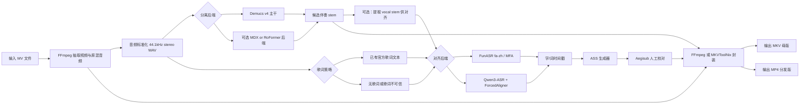

# 面向中文歌曲的 MV 转 KTV 双音轨视频开源方案研究

## 执行摘要

对于“把音乐视频转成 KTV 风格双音轨视频”这个目标，目前**没有一个成熟的单体开源工具**能同时把“高质量去人声”“中文字幕/歌词自动对齐”“KTV 字幕特效”“双音轨封装”全部做好。最接近现成可用的端到端组合是：**UVR 或 Demucs 系列做人声分离**，**Qwen3-ASR / FunASR / MFA 做中文歌词时间对齐**，**Aegisub + ASS 生成 KTV 字幕**，最后用 **FFmpeg / MKVToolNix** 完成双音轨与字幕封装。citeturn23view0turn16view0turn15view3turn14view2turn12view0turn11view2turn25view0turn26view0

如果你的优先级是**中文歌、音质优先、可工程化集成**，我最推荐的架构是：**Demucs v4 作为稳定主干**，再为高难曲目预留 **MDX/RoFormer 类可插拔高质量后端**；歌词对齐优先使用 **Qwen3-ASR + Qwen3-ForcedAligner** 作为“带伴奏/唱腔复杂”的主方案，若你手头已有准确歌词文本且希望更轻量、可控，则用 **FunASR `paraformer-zh` + `fa-zh`** 或 **Mandarin MFA** 作为确定性对齐方案。citeturn16view0turn36view0turn17view0turn17view1turn15view3turn14view0turn14view2turn12view0

## 需求拆解与关键判断

你的目标实际上是四个相互耦合但最好解耦实现的子系统：  
**音频分离**要生成“伴奏轨”和“原混轨”；**歌词对齐**要把中文歌词精确映射到时间轴；**字幕渲染**要把时间轴转成 KTV 样式字幕；**容器封装**要把视频、两条音轨和字幕轨合成为可播放文件。FFmpeg 的 `-map` 与 `-disposition` 可以稳定控制多音轨和默认音轨；Aegisub 的 ASS `\k` 标签可以做逐字/逐音节高亮；libass 则是 ASS 的主流渲染实现。citeturn11view0turn25view0turn25view3turn11view2turn26view1

从工程角度看，**不要追求“一个模型包打天下”**。音乐分离领域已经从早期的 Spleeter / Open-Unmix 过渡到 Demucs、MDX、BS-RoFormer、Mel-Band RoFormer 等更强模型；而歌词时间对齐则是完全不同的问题，Qwen3-ASR 明确支持 **Speech / Singing Voice / Songs with BGM**，Qwen3-ForcedAligner 则单独做时间戳预测，说明“分离”和“对齐”在 SOTA 实践里本来就应当分层。citeturn16view2turn18view2turn16view0turn17view0turn17view1turn15view3

对于**中文歌曲**，最大现实问题不是“模型识不识别中文”这么简单，而是**训练域偏移**：很多经典开源分离模型的主基准是 MUSDB18 / MUSDB18-HQ，而 MDX Challenge 官方论文明确指出该数据集存在对**西方流行音乐**与少数混音风格的偏置。相反，MIR-1K 与 iKala 都是面向中文/华语卡拉 OK 或中文歌曲片段的数据集，并且 iKala 还带**时间标注歌词**，这对中文歌曲的微调与评测非常关键。citeturn9search2turn39search0turn40search3

因此，我的核心判断是：  
**面向中文 KTV 的最佳开源设计不是“找一个万能工具”，而是搭一个模块化流水线**。在这个流水线里，分离后端、对齐后端、字幕生成器、封装器都应当可替换。这样你既能快速落地，也能在后续针对中文歌做微调和 A/B 测试。citeturn23view0turn16view0turn15view3turn11view2turn25view0

## 开源人声分离方案比较

下表聚焦你最关心的“把 MV 变成 KTV 伴奏”的核心：**人声分离 / 去人声**。其中“中文支持”一列特意区分了“模型是否语言无关”和“是否对中文域有专门优化”。

| 项目/模型 | 类型 | 许可证 | 中文支持 | 模型规模 | 输入/输出 | 公开性能 | GPU/CPU 与实时性 | 集成难度 | 结论 |
|---|---|---|---|---|---|---|---|---|---|
| **Demucs v4 / HTDemucs** | 官方模型库 + CLI/Python API | MIT | 声学上语言无关；但官方训练以 MUSDB HQ + 800 首额外歌曲为主，并非中文专项 | 中到大，多变体 | 输入支持 torchaudio/ffmpeg 可读格式；输出 44.1kHz WAV/MP3 | MUSDB-HQ 平均 SDR 9.00 dB；稀疏注意力 + 微调可到 9.20 dB | 官方给出 GPU 至少约 3GB、默认参数约 7GB；CPU 推理约为音频时长的 1.5 倍；**非实时** | 高，CLI 与 Python API 都成熟 | **当前最稳妥的开源主干**，适合做生产默认后端。citeturn16view0turn29view0turn29view1turn33view0turn33view1 |
| **KUIELab MDX-Net** | 官方挑战级研究实现 | MIT | 语言无关；偏研究/竞赛方案 | 中到大；训练资源重 | 以研究训练代码为主，工程入口不如 Demucs 直接 | MDX Challenge 2021 排名：A 榜第 2、B 榜第 3 | 官方训练环境要求至少 4×2080Ti，且数据增强需约 1.5TB 磁盘；说明训练成本高 | 中等，适合研究而非最小落地 | 适合作为**可插拔次优/竞赛级后端**，但不建议直接做第一版产品主干。citeturn16view4turn41view2 |
| **Open-Unmix** | 参考实现 / 研究基线 | MIT；但部分预训练权重附带非商用限制 | 语言无关；不针对中文唱腔 | 中；按官方默认结构估算单目标约 13.6M 参数，四目标约 54.6M 参数 | 官方 CLI 读取 `wav/flac/ogg`，默认不读 `mp3`；输出分离波形 | 2019 年 JOSS 论文称其达到当时开源 SOTA，和 SiSEC 最优未见统计显著差异；Spleeter 对比表中其 vocal SDR 为 6.32 | 官方默认是双向 LSTM，**不能在线/实时**；若训练单向模型可用于更低延迟 | 高，结构非常清晰，适合二次研究 | **很好的可复现实验基线**，但单论今天的 KTV 去人声质量，通常不如 Demucs / 新型 RoFormer。citeturn18view2turn29view4turn35view0turn35view2turn22view2 |
| **Spleeter** | 经典开源工具 / CLI / Docker | MIT | 语言无关；不是中文专项 | 中；2/4/5 stems 多配置 | 官方示例输入 MP3，输出 `vocals.wav` / `accompaniment.wav` | 4-stem GPU 速度可达 **100× real-time**；在 MUSDB18 上 vocal SDR 6.55，MWF 版本 6.86 | CPU/GPU 都可；**速度非常强**，质量已被更新模型超越 | 非常高，安装和 Docker 友好 | **速度优先、质量次优**。适合低成本批处理或快速 PoC，但不建议作为中文 KTV 音质优先方案。citeturn16view2turn29view2turn34view0turn34view1turn34view2turn22view1 |
| **BS-RoFormer** | 论文模型 + 开源实现 | 代码实现 MIT；论文开源 | 语言无关；对复杂伴奏分离能力强 | 大；官方摘要未统一给参数量 | 以研究代码/社区权重为主 | MUSDB18HQ 上小型版平均 SDR 9.80 dB，并获 SDX’23 第一 | 推理较重，一般需较强 GPU；不面向实时 | 中等，依赖社区训练/权重生态 | **质量上很有吸引力**，但官方工程化、权重治理与复现链路不如 Demucs。适合作为高级可插拔后端。citeturn16view6turn17view0turn22view4 |
| **Mel-Band RoFormer** | 论文模型，权重多在社区 | 论文公开；工程实现多为社区 | 语言无关；论文显示对 vocals/drums/other 进一步提升 | 大；官方摘要未统一给参数量 | 工程入口多依赖社区实现 | 论文摘要称在 MUSDB18HQ 上 **outperform BS-RoFormer** 于 vocals/drums/other | 一般较重；适合离线高质量分离 | 中等偏高，依赖社区权重质量 | **理论上极强**，但当前更适合作为“可选高级模型”，不是最稳健的第一版主干。citeturn17view1turn17view2 |
| **Ultimate Vocal Remover** | GUI/桌面编排器，不是单一模型 | MIT | 间接支持中文；因为它集成/调用多个分离架构 | 取决于后端模型 | 桌面 GUI；模型会在首次运行下载 | 自身不提供统一基准；质量取决于所选后端与权重 | 面向离线桌面处理，不是实时服务框架 | **终端用户最容易上手** | **最接近“现成可用”的人声去除工具**，尤其适合人工试模型；但它不解决歌词对齐和双音轨封装。citeturn23view0turn23view1turn23view2turn23view3 |
| **Conv-TasNet / Asteroid** | 通用时域分离架构 | Asteroid MIT | 对中文音乐并非主战场；原论文主任务是**语音分离** | 小到中；论文强调 small model size | 研究库/recipes 为主 | 原论文主指标是语音分离上的 SDRi / SI-SNRi，不是音乐 stem benchmark | 论文明确可离线/实时；低延迟优势明显 | 中等，适合研究而非直接用于 KTV 音乐分离 | **不推荐直接作为中文歌曲 KTV 去人声主模型**；更适合做低延迟语音场景或研究对照。citeturn16view9turn17view3turn17view4 |

对你的场景，最重要的结论是：**若只选一个主力开源后端，选 Demucs v4**；若你愿意为音质再多花一倍以上算力，建议做 **Demucs + RoFormer/MDX 类候选模型** 的双模型或三模型可插拔架构。一个很有说服力的证据是，MDX23 的公开竞赛模型本身就是把 **Demucs4、MDX 架构和 UVR 权重**组合在一起，而不是只依赖单一模型。citeturn16view5turn36view0

“PESQ 是否要纳入主评估”这一点，我的判断是：**在音乐分离官方资料里，公开主指标几乎都以 SDR / SI-SDR 为主，PESQ 很少是第一指标**；因此在 KTV 任务里，PESQ 更适合作为辅助诊断，而不是模型选择的第一准则。这个判断是基于 Demucs、Spleeter、Open-Unmix、BS-RoFormer 等官方论文/README 的公开指标体系做出的工程归纳。citeturn16view0turn34view1turn18view2turn17view0

## 中文歌词对齐与字幕方案

中文歌词对齐建议按**“是否已有准确歌词文本”**分为两条路线：

如果你**已经有准确歌词文本**，优先走“**强制对齐**”路线。这里最值得优先考虑的是 **FunASR** 和 **Mandarin MFA**。FunASR 官方直接提供了 `paraformer-zh`（220M，带时间戳）和 `fa-zh`（38M，时间戳预测）两个关键模型，且有 Python API 和 ONNX 导出入口；Mandarin MFA 则提供了官方 Mandarin 模型与词典，适合做“文本已知、我要稳定对齐”的确定性流水线。citeturn14view0turn14view2turn29view6turn12view0turn11view5

如果你**没有完整歌词文本**，或者歌词可能与演唱版本有差异，优先走“**ASR 先转写、再对齐**”路线。这里目前我最看好的是 **Qwen3-ASR + Qwen3-ForcedAligner**：官方 README 明确写到它支持 **Chinese、22 种中文方言、Singing Voice、Songs with BGM**，并且 Qwen3-ForcedAligner 在其中文 benchmark 上的 AAS 为 **33.1 ms**，优于文中列出的 Monotonic-Aligner（161.1 ms）与 NFA（109.8 ms）。对于“原视频带伴奏、唱腔不是朗读”的中文歌，这非常有价值。citeturn15view3

WhisperX 依然是一个有用的备份方案，尤其适合多语言和快速实验：官方给出 **60–70× real-time** 的 batched inference 速度，并支持通过 torchaudio / Hugging Face 的语言特定对齐模型做强制对齐。但它也明确写了两点局限：其一，**需要语言特定的对齐模型**；其二，v3 中 **ASS 输出被移除**。因此它更适合作为实验或应急对齐器，而不是中文 KTV 系统中的第一优先级字幕后端。citeturn13view0turn30view1turn30view3

Aeneas 和 `ctc-segmentation` 更适合做“低层工具”或“研究拼装件”。Aeneas 是多语言 forced alignment 库，但它本质上更偏“文本-音频同步工具”，对**歌曲演唱**通常不如专门的 ASR/forced aligner 稳；`ctc-segmentation` 则非常强，速度也快，但它要求你自己准备 **CTC posterior**，更适合作为你系统内部的算法模块，而不是产品第一版的直接入口。citeturn13view3turn13view4

下面是我对中文歌词对齐工具的工程排序。

| 工具 | 路线 | 中文能力 | 时间粒度 | 许可证 | 模型规模 | 适合的输入 | 优点 | 主要短板 |
|---|---|---|---|---|---|---|---|---|
| **Qwen3-ASR + Qwen3-ForcedAligner** | ASR + 强制对齐 | 中文 + 22 中文方言；支持 singing voice / songs with BGM | 任意 units 的 timestamp prediction；官方有中文 AAS benchmark | Apache-2.0 | ASR 0.6B / 1.7B；Aligner 0.6B | 原混轨、分离 vocal、带伴奏歌曲 | **最适合中文歌和伴奏场景**；服务化能力强，支持 vLLM/异步服务 | 模型较大，GPU 成本高。citeturn15view3turn22view5 |
| **FunASR `paraformer-zh` + `fa-zh`** | ASR + 时间戳预测 | 官方中文强项 | 句级/词级时间戳，文本已知时可强制时间戳预测 | MIT | `paraformer-zh` 220M，`fa-zh` 38M | 中文歌曲 vocal stem 或较干净原混轨 | **轻量、中文友好、ONNX 友好** | 对复杂唱腔/拖长音的鲁棒性要靠你自己验证。citeturn14view0turn14view2turn13view1 |
| **Mandarin MFA** | 传统 forced alignment | Mandarin 模型与词典齐备 | phone / word 级 | MIT；模型 CC BY 4.0 | 官方模型为 GMM-HMM | 文本已知、较干净 vocal | 结果可控、流程经典、适合批量离线 | 官方说明其 Mandarin 模型训练于 read speech，唱歌域偏移明显，通常需要 adaptation。citeturn11view4turn12view0 |
| **WhisperX** | Whisper ASR + wav2vec2 对齐 | 中文可通过 HF 对齐模型接入 | word-level | BSD-2-Clause（仓库）*此处未单列检索许可证，本文主要引用其功能特征* | 取决于所选 Whisper 大小 | 通用音频、多语言 | 实验快，支持批处理、VAD，速度非常高 | 中文需要自行确认 align model；v3 去掉了 ASS 输出。citeturn13view0turn30view1 |
| **aeneas** | 文本-音频同步 | 多语言，但更偏朗读 | fragment-level | AGPLv3 *许可证未在本次核心检索中展开，功能性已确认* | 轻量 | 已知歌词 + 较规则演唱 | 简单，易嵌入 | 对流行歌曲、装饰音、节奏自由段落往往不够稳。citeturn13view3 |
| **ctc-segmentation** | 低层 CTC 对齐模块 | 取决于上游 CTC ASR | char / utterance-level | Apache-2.0 *功能面为主* | 取决于上游 ASR | 文本已知、你能产出 CTC logits | 快、可定制、适合内部算法管线 | 不是开箱即用产品组件。citeturn13view4 |

对于**KTV 字幕格式**，建议直接以 **ASS** 为主，而不是只用 SRT/LRC。原因很简单：Aegisub 的 ASS `\k / \K / \kf / \ko` 系列标签就是为 karaoke 效果设计的，持续时间单位是 centiseconds；而 libass 是 ASS/SSA 的主流渲染器。这意味着你可以先用 ASR/对齐器得到“字/词时间戳”，再自动转换为可编辑的 `.ass`，必要时让人工在 Aegisub 中做最后 5% 的精修。citeturn11view2turn11view3turn26view1

中文数据方面，做微调与评测时最有价值的两个公开数据集是：  
**MIR-1K**：1000 个片段，伴奏和歌声分别录在左右声道，并附带歌词；  
**iKala**：252 个 30 秒中文歌曲片段，伴奏和歌声分别录制，并带有**时间标注歌词**。  
这两个数据集非常契合“中文歌 + 卡拉 OK + 对齐/分离联合评测”的需求。citeturn39search0turn40search3

## 双音轨封装与 KTV 视频生成

对于最终交付文件，我建议把“**母版格式**”和“**分发格式**”分开。  
母版格式优先用 **MKV**：它天然适合多音轨、多字幕轨和字体附件管理，MKVToolNix 也是 Matroska 的事实参考实现之一。分发格式如果必须是 MP4，可以保留双 AAC 音轨，但复杂 ASS karaoke 特效在很多播放器上的一致性不如 “MKV + softsub” 或“直接硬烧录”。citeturn26view0turn25view0turn25view3turn26view1

FFmpeg 的关键点有两个：  
其一，用 `-map` **显式控制**输出包含哪些视频、音频、字幕流；  
其二，用 `-disposition` 把伴奏轨设成默认，把原唱轨设成可选音轨。FFmpeg 官方文档明确说明了 `-map` 的手工选择逻辑，以及 `-disposition:a:1 default` 之类的默认流控制方式。citeturn11view0turn25view0turn25view3

Aegisub 则负责“字幕质量的最后一公里”。它提供了“Timing karaoke to a song”“Creating fancy karaoke effects”等面向歌曲字幕的工作流，适合作为人工 QA 工具，而自动系统则把机器生成的 `.ass` 交给 Aegisub 编辑。citeturn11view3

下面给出一套实用的 FFmpeg 工作流示例。

### 典型 FFmpeg 命令

先从 MV 中抽出原始音频：

```bash
ffmpeg -i input_mv.mp4 -vn -ac 2 -ar 44100 -c:a pcm_s16le mix.wav
```

如果你已经得到 `instrumental.wav` 和 `original_mix.wav`，并生成了 `lyrics.ass`，可以这样封装成 **双音轨 + 软字幕** 的 MKV：

```bash
ffmpeg \
  -i input_mv.mp4 \
  -i instrumental.wav \
  -i original_mix.wav \
  -i lyrics.ass \
  -map 0:v:0 \
  -map 1:a:0 \
  -map 2:a:0 \
  -map 3:0 \
  -c:v copy \
  -c:a aac -b:a 320k \
  -c:s ass \
  -metadata:s:a:0 title="伴奏" \
  -metadata:s:a:0 language=zho \
  -metadata:s:a:1 title="原唱" \
  -metadata:s:a:1 language=zho \
  -metadata:s:s:0 title="歌词" \
  -metadata:s:s:0 language=zho \
  -disposition:a:0 default \
  -disposition:a:1 0 \
  output_ktv.mkv
```

如果你需要一个**播放器兼容性更高**的交付文件，可以直接把 ASS 硬烧到视频里，音频只保留伴奏：

```bash
ffmpeg \
  -i input_mv.mp4 \
  -i instrumental.wav \
  -vf "subtitles=lyrics.ass" \
  -map 0:v:0 \
  -map 1:a:0 \
  -c:v libx264 -crf 18 -preset slow \
  -c:a aac -b:a 320k \
  output_ktv_burned.mp4
```

如果你要保留双音轨但只做简单软字幕，也可以导出 MP4 + `mov_text` 字幕，不过这更适合“普通字幕”，而不是复杂 karaoke 特效：

```bash
ffmpeg \
  -i input_mv.mp4 \
  -i instrumental.wav \
  -i original_mix.wav \
  -i lyrics.srt \
  -map 0:v:0 \
  -map 1:a:0 \
  -map 2:a:0 \
  -map 3:0 \
  -c:v copy \
  -c:a aac -b:a 256k \
  -c:s mov_text \
  -disposition:a:0 default \
  -disposition:a:1 0 \
  output_dual_audio.mp4
```

这些命令之所以可靠，是因为它们使用了 FFmpeg 官方支持的手工流映射和默认流处置机制，而 ASS 渲染则依赖 FFmpeg 的 subtitles/ass 过滤链与 libass。citeturn11view0turn25view0turn25view3turn24search0turn26view1

## 推荐架构与实现细节

如果目标是“高质量 + 可扩展 + 能做中文专项优化”，推荐采用下面的**模块化服务架构**。



这套架构的关键设计点有三条。

第一，**分离和对齐分开**。UVR 的流行恰恰说明了桌面端用户需要“先挑模型把歌拆开”，但 UVR 自己并不提供真正完备的中文歌词对齐与封装链路；而 Qwen3-ASR/FunASR/MFA 则根本是另一类工具。因此，把“人声分离”和“歌词对齐”拆成两个可插拔后端，是最符合开源生态现状的设计。citeturn23view0turn15view3turn14view0turn12view0

第二，**默认先跑 Demucs，再按质量门限触发高级模型**。Demucs 的开源治理、许可证、CLI/API、I/O 兼容性都更成熟；但对于中文流行歌里高混响、密集和声、合唱堆叠的难例，你应该预留 RoFormer/MDX 类“高质量慢模型”插槽。实践上可以定义一个简单的 reranker：  
- 对候选伴奏做**残留人声检测**，例如在 accompaniment 上跑一次中文 ASR，若可识别歌词过多则判定泄漏严重；  
- 对候选 vocal 做音质检验，例如语音/歌声清晰度、静音段干净程度；  
- 选择综合得分更高的 stem。  
MDX23 公开模型采用多架构组合，本身就支持“ensemble 比单模型更稳”的工程结论。citeturn16view5turn36view0

第三，**字幕产物以 ASS 为主，SRT/LRC 为辅**。内部 canonical 表示建议用 JSON：
```json
{
  "lang": "zh",
  "lines": [
    {
      "start": 12.34,
      "end": 15.92,
      "text": "后来终于在眼泪中明白",
      "tokens": [
        {"text": "后", "start": 12.34, "end": 12.62},
        {"text": "来", "start": 12.62, "end": 12.98}
      ]
    }
  ]
}
```
然后从这份 JSON 派生出 `.ass`、`.srt`、`.lrc`。这样一来，Aegisub 负责编辑 `.ass`，播放器兼容性需求则由 `.srt` / `.lrc` 满足。Aegisub 的 `\k` 标签天然支持从 token-duration 自动生成 KTV 高亮。citeturn11view2turn11view3

### 推荐 API 设计

如果你做成服务，我建议最少暴露以下四类 API：

| API | 方法 | 输入 | 输出 | 说明 |
|---|---|---|---|---|
| `/separate` | POST | MV/音频文件 + 模型名 | stems 路径 | 跑 Demucs/MDX/RoFormer |
| `/align` | POST | vocal/original 音频 + 歌词文本 | token 级时间戳 JSON | 跑 Qwen/FunASR/MFA |
| `/render_subtitles` | POST | 时间戳 JSON + 模板样式 | `.ass` / `.srt` / `.lrc` | 生成字幕 |
| `/mux` | POST | 视频 + 双音轨 + 字幕 | `.mkv` / `.mp4` | FFmpeg / MKVToolNix 封装 |

服务框架上，**FastAPI** 很适合做正式 API 层，因为它天然适合容器化部署；而 **Gradio** 很适合做内部试验 UI、模型选择面板和人工 QA 页面。FastAPI 官方有完整 Docker 部署文档；Gradio 官方明确支持快速构建 Python 交互式 ML Web 应用。citeturn27view0turn26view3turn27view1

### 样例代码

下面给一个“**先分离，再混合非人声 stem 为伴奏，再生成可封装产物**”的最小 Python 片段。

```python
from pathlib import Path
import subprocess

def run(cmd):
    subprocess.run(cmd, check=True)

def separate_with_demucs(input_audio: str, out_dir: str, model: str = "htdemucs"):
    run([
        "python", "-m", "demucs",
        "-n", model,
        "-o", out_dir,
        input_audio
    ])
    track_dir = Path(out_dir) / model / Path(input_audio).stem
    return {
        "vocals": track_dir / "vocals.wav",
        "drums": track_dir / "drums.wav",
        "bass": track_dir / "bass.wav",
        "other": track_dir / "other.wav",
    }

def make_instrumental(stems: dict, output_wav: str):
    run([
        "ffmpeg", "-y",
        "-i", str(stems["drums"]),
        "-i", str(stems["bass"]),
        "-i", str(stems["other"]),
        "-filter_complex", "amix=inputs=3:normalize=0",
        "-c:a", "pcm_s16le",
        output_wav
    ])

def mux_dual_audio(video_path: str, instrumental_wav: str, original_mix_wav: str, ass_path: str, output_path: str):
    run([
        "ffmpeg", "-y",
        "-i", video_path,
        "-i", instrumental_wav,
        "-i", original_mix_wav,
        "-i", ass_path,
        "-map", "0:v:0",
        "-map", "1:a:0",
        "-map", "2:a:0",
        "-map", "3:0",
        "-c:v", "copy",
        "-c:a", "aac", "-b:a", "320k",
        "-c:s", "ass",
        "-metadata:s:a:0", "title=伴奏",
        "-metadata:s:a:1", "title=原唱",
        "-disposition:a:0", "default",
        "-disposition:a:1", "0",
        output_path
    ])
```

下面这个函数则把“字级时长”转成最简单的 ASS karaoke 片段：

```python
def ass_karaoke_text(tokens):
    """
    tokens: list of {"text": str, "start": float, "end": float}
    ASS \\k 单位是 centiseconds
    """
    parts = []
    for tok in tokens:
        dur_cs = max(1, round((tok["end"] - tok["start"]) * 100))
        parts.append(rf"{{\k{dur_cs}}}{tok['text']}")
    return "".join(parts)

# 示例
tokens = [
    {"text": "后", "start": 12.34, "end": 12.62},
    {"text": "来", "start": 12.62, "end": 12.98},
]
print(ass_karaoke_text(tokens))  # {\k28}后{\k36}来
```

## 训练微调与评估计划

如果你只做“集成现成模型”，第一版已经能用；但如果你想把“中文歌的伴奏质量”做到更强，建议从一开始就为**中文微调**预留数据与评测闭环。原因是官方也承认：主流分离基准 MUSDB18/18-HQ 存在西方流行音乐偏置；而 MIR-1K、iKala 则更贴近中文卡拉 OK 场景。citeturn9search2turn39search0turn40search3

### 建议使用的数据

| 数据集 | 作用 | 中文相关性 | 可用于什么 |
|---|---|---|---|
| **MUSDB18 / MUSDB18-HQ** | 通用基准 | 低 | 与公开论文可比的 SDR/SiSEC 风格指标 |
| **MIR-1K** | 中文唱段 | 高 | 中文歌分离微调、歌词/人声泄漏检查 |
| **iKala** | 中文歌曲 + 时间歌词 | 很高 | 中文歌分离评测、歌词对齐评测、端到端 KTV QA |

MIR-1K 官方说明其 1000 个片段中伴奏与歌声音轨被分离记录，并附带歌词；iKala 则包含人工标注的音高轮廓与**timestamped lyrics**。这意味着你可以用同一个中文数据基座同时评测“分离”和“对齐”。citeturn39search0turn40search3

### 分离模型的微调建议

我建议的优先顺序是：

先做 **inference-time 策略优化**，再做 **轻量微调**，最后才考虑大规模重训。  
具体而言：

- **第一步**：先比较 `htdemucs`、`htdemucs_ft`、一组 UVR/MDX/RoFormer 候选权重在中文歌上的泄漏与伪影差异。  
- **第二步**：在 MIR-1K / iKala / 你合法持有的中文 stem 数据上做小规模微调，目标只优化 **vocals vs accompaniment** 二分类 stem，而不是四 stem 全量重训。  
- **第三步**：如果真的要追求最强结果，再做多模型集成或蒸馏，把慢模型的质量蒸馏到更稳的主模型上。  

这个顺序的原因是：Demucs 的工程成熟度最高，而竞赛级高分模型往往要付出更大的计算代价和更复杂的复现成本。KUIELab MDX-Net 官方训练环境甚至要求至少 4×2080Ti 与 1.5TB 数据增强存储，这对第一版产品往往并不划算。citeturn41view2turn33view1

### 评估指标与验收标准

对分离模型，建议同时看三层指标：

**学术指标**  
使用 SDR / SI-SDR 做主指标，与 Demucs、Open-Unmix、Spleeter 等公开文献保持可比性。Demucs、Spleeter、Open-Unmix、BS-RoFormer 的公开主指标都建立在这一套体系上。citeturn16view0turn34view1turn18view2turn17view0

**KTV 任务指标**  
这部分比纯学术更重要，建议增加两项：
- **Accompaniment lyric leakage**：在 accompaniment 轨上跑中文 ASR，若还能稳定识别出歌词，说明人声残留过重；  
- **Singer suppression MOS**：人工听感打分，评价“伴奏是否还能听到主唱影子”。  

**对齐指标**  
如果你有人工校准数据，可用：
- 字/词边界 MAE；
- 行级对齐误差；
- KTV 可唱性主观分。  
Qwen 官方提供了 AAS（Alignment Absolute Shift）作为对齐 benchmark，其中中文例子可做到 33.1 ms 量级，这可以作为你系统的参考上限。citeturn15view3

### 我建议的评测集划分

工程上最好准备一个 **30–50 首中文歌**的小型验收集，覆盖：
- 男声 / 女声；
- 抒情 / 快歌 / rap；
- 独唱 / 合唱 / 对唱；
- 强混响 / 现场版 / 消音困难曲。  

对每首歌输出三类结果：  
伴奏轨、原混轨、ASS 字幕成品。然后让测试者从三个维度打分：  
**伴奏纯净度、歌词同步感、整体 KTV 可用性**。  
这是最贴近产品目标的评价方式。

## 路线图与限制

下面给出一个偏务实、可落地的实施路线图。这里的工期和资源是**工程估算**，不是外部事实引用。

| 阶段 | 目标 | 主要产出 | 估算资源 |
|---|---|---|---|
| **原型阶段** | 跑通最小闭环 | Demucs 主干、Qwen/FunASR 二选一、ASS 生成器、FFmpeg 双音轨封装 | 1 名工程师，1 台 12–24GB VRAM GPU，约 1–2 周 |
| **试运行阶段** | 完成中文歌质量验证 | 30–50 首中文歌测试集、人工 QA 流程、Aegisub 修订链路、MKV 母版导出 | 1–2 名工程师，1 名标注/QA，约 2–4 周 |
| **增强阶段** | 引入高质量可插拔后端 | UVR/MDX/RoFormer 模型池、分离 reranker、失败回退逻辑 | 1 台更强 GPU 或多卡，约 2–3 周 |
| **部署阶段** | 对外/对内服务化 | FastAPI API、Gradio 管理台、Docker 镜像、作业队列、对象存储 | 1 名后端 + 1 名 ML 工程师，约 2–4 周 |

在部署形态上，我建议分三档：

- **桌面离线工具**：UVR + Aegisub + FFmpeg，适合人工逐首制作。citeturn23view0turn11view3turn25view0  
- **CLI 批处理流水线**：Demucs/FunASR/Qwen/FFmpeg，适合服务器批量转码。citeturn16view0turn14view0turn15view3turn25view0  
- **Web 服务**：FastAPI 做 API，Gradio 做运营或标注 UI，底层容器化部署。citeturn27view0turn26view3turn27view1  

### 开放问题与限制

当前最需要你在项目早期明确的限制有四个。

其一，**社区权重的许可证治理**。像 Demucs、Spleeter、Open-Unmix、MFA、FunASR、Qwen3-ASR 这类项目的代码许可证相对清晰；但不少高质量 UVR 社区权重、RoFormer 权重的再发布与商用权限并不总是像代码仓库那样清楚，落地前必须逐个核对。本文因此把“许可证清晰、官方入口稳定”的项目作为核心推荐。citeturn22view0turn22view1turn22view2turn11view4turn13view1turn22view5

其二，**唱歌不是朗读**。Mandarin MFA 官方就明确提醒其 Mandarin 模型训练于 read speech，数据一旦偏离这种域，可能需要更大 beam 或 adaptation。中文流行唱法、长拖音、切分、转音都会让传统 forced alignment 比普通语音更困难。citeturn12view0

其三，**没有单一“最佳容器”**。MKV 更适合做双音轨 + ASS 母版；MP4 更利于分发兼容；若你要求“任何播放器都看到一致的 KTV 高亮”，最后往往还是要准备一个**硬烧录 MP4**版本。这个不是工具缺陷，而是播放器与字幕渲染链的现实差异。citeturn26view0turn26view1turn25view0

其四，**版权与数据合法性**。Spleeter 官方 README 就提醒，若处理受版权保护的内容，需要事先取得授权。对于 MV、伴奏、歌词文本和字体附件，这一点都适用。citeturn22view1

综合来看，若你现在就要启动，我建议的默认技术栈可以压缩为一句话：  
**Demucs v4 做默认分离，Qwen3-ASR + ForcedAligner 做中文歌主对齐，FunASR/MFA 做已知歌词的轻量替代，ASS 作为主字幕格式，FFmpeg + MKVToolNix 产出双音轨 KTV 母版。** 这是目前开源生态里在“质量、可复现、可部署、中文适应性”之间最平衡的一条路。citeturn16view0turn15view3turn14view0turn12view0turn11view2turn25view0turn26view0